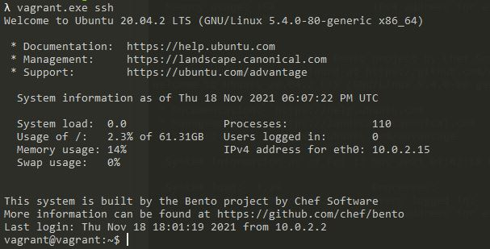

1. __Установите средство виртуализации Oracle VirtualBox.__
	
	Выполнено
2. __Установите средство автоматизации Hashicorp Vagrant.__
	
	Выполнено
3. __В вашем основном окружении подготовьте удобный для дальнейшей работы терминал.__
	
	Выполнено
4. __С помощью базового файла конфигурации запустите Ubuntu 20.04 в VirtualBox посредством Vagrant.__
	
	
5. __Ознакомьтесь с графическим интерфейсом VirtualBox, посмотрите как выглядит виртуальная машина, которую создал для вас Vagrant,
 какие аппаратные ресурсы ей выделены. Какие ресурсы выделены по-умолчанию?__
	
	

6. __Ознакомьтесь с возможностями конфигурации VirtualBox через Vagrantfile: документация. Как добавить оперативной памяти или ресурсов
 процессора виртуальной машине?__

		config.vm.provider "virtualbox" do |vb|
		  vb.memory = 1024
		  vb.cpus = 2
		end

7. __Команда vagrant ssh из директории, в которой содержится Vagrantfile, позволит вам оказаться внутри виртуальной машины без каких-либо дополнительных настроек. Попрактикуйтесь в выполнении обсуждаемых команд в терминале Ubuntu.__
	
	
8. __Ознакомиться с разделами man bash, почитать о настройках самого bash:__
	- Какой переменной можно задать длину журнала history, и на какой строчке manual это описывается?
	
		HISTSIZE - количество команд для сохранения. 
		Строка 1178
		
		HISTFILESIZE - число команд для сохранения.
		Строка 1155
	
	- Что делает директива ignoreboth в bash?
	
		Игнорирует дублирующиеся записи и команды начинающиеся с пробела 

9. __В каких сценариях использования применимы скобки {} и на какой строчке man bash это описано?__

		Цикличное выполнение команд с подстановкой например mkdir ./int_{1..10} - создаст каталоги сименами int_1, int_2 и т.д. до int_10
		или rmdir ./int_{1..10} - удалит каталоги int_1 - int_10
		Строка 343
	

10. __Основываясь на предыдущем вопросе, как создать однократным вызовом touch 100000 файлов?__
		touch {1..100000}
		А получилось ли создать 300000? Если нет, то почему?
		
		Нет. Слишком длинный список аргументов

11. __В man bash поищите по /\[\[. Что делает конструкция [[ -d /tmp ]]__
	
		Проверяет существует ли каталог /tmp

12. __Основываясь на знаниях о просмотре текущих (например, PATH) и установке новых переменных; 
командах, которые мы рассматривали, добейтесь в выводе type -a bash в виртуальной машине наличия первым пунктом в списке:__

		bash is /tmp/new_path_directory/bash
		bash is /usr/local/bin/bash
		bash is /bin/bash
(прочие строки могут отличаться содержимым и порядком) В качестве ответа приведите команды, которые позволили вам добиться указанного вывода или соответствующие скриншоты.
	
		vagrant@vagrant:~$ mkdir /tmp/new_path_dir/
		vagrant@vagrant:~$ cp /bin/bash /tmp/new_path_dir/
		vagrant@vagrant:~$ type -a bash
		bash is /usr/bin/bash
		bash is /bin/bash
		vagrant@vagrant:~$ PATH=/tmp/new_path_dir/:$PATH
		
 
 
13. __Чем отличается планирование команд с помощью batch и at?__

	Команда at используется для назначения одноразового задания на заданное время, 
	а команда batch — для назначения одноразовых задач, которые должны выполняться, когда загрузка системы становится меньше 0,8.
