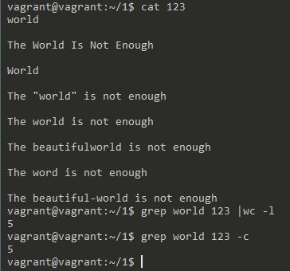
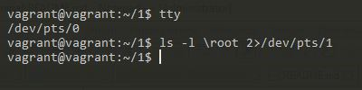
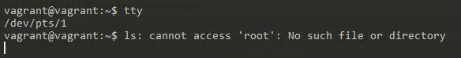
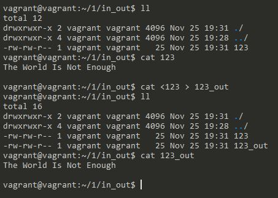
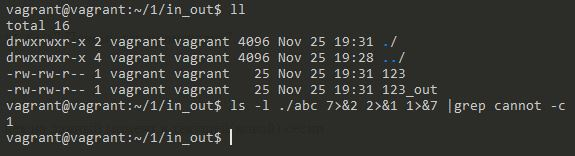
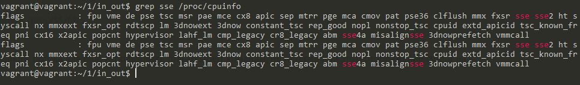
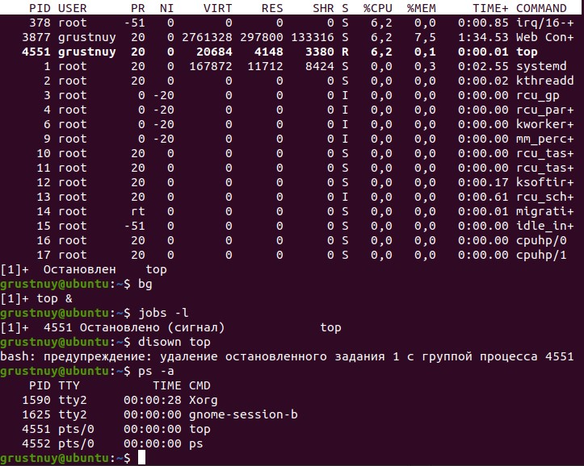
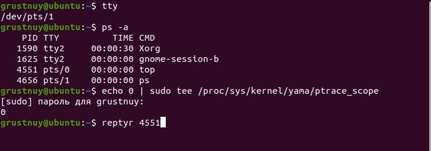
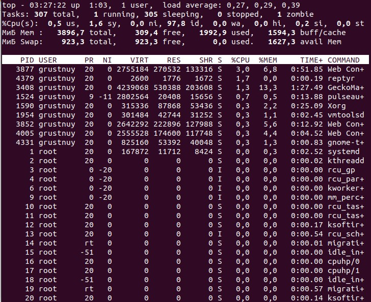

1. Какого типа команда `cd`? Попробуйте объяснить, почему она именно такого типа; 
опишите ход своих мыслей, если считаете что она могла бы быть другого типа.

			Это встроенная команда меняющая текущую папку только для той оболочки, в которой выполняется.
			Если использовать внешний вызов, то он будет работать со своим окружением, и 
			менять текущий каталог внутри своего окружения, а на вызвавший shell влиять не будет
1. Какая альтернатива без pipe команде `grep <some_string> <some_file> | wc -l`? `man grep` поможет в
 ответе на этот вопрос. Ознакомьтесь с документом о других подобных некорректных вариантах использования pipe.
 
	
	
1. Какой процесс с PID `1` является родителем для всех процессов в вашей виртуальной машине Ubuntu 20.04?

			systemd
			vagrant@vagrant:~/1$ pstree -p
			systemd(1)─┬─VBoxService(748)─┬─{VBoxService}(750)
					   │                  ├─{VBoxService}(751)
					   │                  ├─{VBoxService}(752)
					   │                  ├─{VBoxService}(753)
					   │                  ├─{VBoxService}(754)
					   │                  ├─{VBoxService}(755)
					   │                  ├─{VBoxService}(756)
					   │                  └─{VBoxService}(757)
					   ├─accounts-daemon(557)─┬─{accounts-daemon}(599)
					   │                      └─{accounts-daemon}(667)
					   ├─agetty(635)
					   ├─atd(633)
					   ├─cron(618)
					   ├─dbus-daemon(558)
					   ├─irqbalance(563)───{irqbalance}(575)
					   ├─multipathd(508)─┬─{multipathd}(509)
					   │                 ├─{multipathd}(510)
					   │                 ├─{multipathd}(511)
					   │                 ├─{multipathd}(512)
					   │                 ├─{multipathd}(513)
					   │                 └─{multipathd}(514)
					   ├─networkd-dispat(564)
					   ├─polkitd(758)─┬─{polkitd}(763)
					   │              └─{polkitd}(765)
					   ├─rpcbind(535)
					   ├─rsyslogd(565)─┬─{rsyslogd}(623)
					   │               ├─{rsyslogd}(624)
					   │               └─{rsyslogd}(625)
					   ├─sshd(668)───sshd(1068)───sshd(1115)───bash(1116)───pstree(1283)
					   ├─systemd(1078)───(sd-pam)(1082)
					   ├─systemd-journal(345)
					   ├─systemd-logind(574)
					   ├─systemd-network(379)
					   ├─systemd-resolve(536)
					   ├─systemd-udevd(373)
					   └─tmux: server(1193)───bash(1203)
1. Как будет выглядеть команда, которая перенаправит вывод stderr `ls` на другую сессию терминала?
	
	
1. Получится ли одновременно передать команде файл на stdin и вывести ее stdout в другой файл? Приведите работающий пример.

	
1. Получится ли вывести находясь в графическом режиме данные из PTY в какой-либо из эмуляторов TTY? Сможете ли вы наблюдать выводимые данные?
	
			Получиться. Просматрировать данные возможно при переключении в TTY.
			vagrant@vagrant:~$ tty                                      
			/dev/pts/1                                                  
			vagrant@vagrant:~$ sudo echo "Привет tty3 приветствует pts1" >/dev/tty3
	
1. Выполните команду `bash 5>&1`. К чему она приведет? Что будет, если вы выполните `echo netology > /proc/$$/fd/5`? Почему так происходит?

			bash 5>&1 - Создаст дескриптор с 5 и перенаправит его в stdout
			echo netology > /proc/$$/fd/5 - выведет в дескриптор "5", который был пернаправлен в stdout
			

1. Получится ли в качестве входного потока для pipe использовать только stderr команды, не потеряв при этом 
отображение stdout на pty? Напоминаем: по умолчанию через pipe передается только stdout команды слева от `|` на stdin команды справа.
Это можно сделать, поменяв стандартные потоки местами через промежуточный новый дескриптор, который вы научились создавать в предыдущем вопросе.

	
			
			7>&2 - новый дескриптор перенаправили в stderr
			2>&1 - stderr перенаправили в stdout 
			1>&7 - stdout - перенаправили в в новый дескриптор
1. Что выведет команда `cat /proc/$$/environ`? Как еще можно получить аналогичный по содержанию вывод?

			Будут выведены переменные окружения.
			Аналогичный по содержанию вывод можно получить командой `env`
1. Используя `man`, опишите что доступно по адресам `/proc/<PID>/cmdline`, `/proc/<PID>/exe`.

			`/proc/<PID>/cmdline` - полный путь до исполняемого файла процесса [PID]  
			`/proc/<PID>/exe` - содержит ссылку до файла запущенного для процесса [PID]
1. Узнайте, какую наиболее старшую версию набора инструкций SSE поддерживает ваш процессор с помощью `/proc/cpuinfo`.

			SSE 4a
	
1. При открытии нового окна терминала и `vagrant ssh` создается новая сессия и выделяется pty. Это можно подтвердить командой `tty`, которая упоминалась в лекции 3.2. Однако:

    ```bash
	vagrant@netology1:~$ ssh localhost 'tty'
	not a tty
    ```
	Почитайте, почему так происходит, и как изменить поведение.
	
			При подключении ожидается пользователь, а не другой процесс, отсутствует локальный tty в данный момент. 
			Для запуска можно добавить `-t` , и команда выполнится c принудительным созданием псевдотерминала
	
1. Бывает, что есть необходимость переместить запущенный процесс из одной сессии в другую. Попробуйте сделать это,
 воспользовавшись `reptyr`. Например, так можно перенести в `screen` процесс, который вы запустили по ошибке в обычной SSH-сессии.
			
	
	
	

1. `sudo echo string > /root/new_file` не даст выполнить перенаправление под обычным пользователем, так как перенаправлением
 занимается процесс shell'а, который запущен без `sudo` под вашим пользователем. Для решения данной проблемы можно использовать
 конструкцию `echo string | sudo tee /root/new_file`. Узнайте что делает команда `tee` и почему в отличие от `sudo echo` команда с `sudo tee` будет работать.
 
			`tee` делает вывод одновременно и в файл, указаный в качестве параметра, и в stdout, в данном примере команда 
			получает вывод из stdin, перенаправленный через pipe от stdout команды echo и так как команда запущена от sudo ,
			соотвественно имеет права на запись в файл.
 
