1. __Узнайте о sparse (разряженных) файлах.__ 
		Ознакомился.

2. __Могут ли файлы, являющиеся жесткой ссылкой на один объект, иметь разные права доступа и владельца? Почему?__
		Немогут. Hardlink имеют один и тотже Inode и фактически являються идентичнымы объектами файловой системы. 

3. __Сделайте vagrant destroy на имеющийся инстанс Ubuntu. Замените содержимое Vagrantfile следующим:__

		Vagrant.configure("2") do |config| 
		  config.vm.box = "bento/ubuntu-20.04" 
		  config.vm.provider :virtualbox do |vb| 
			lvm_experiments_disk0_path = "/tmp/lvm_experiments_disk0.vmdk" 
			lvm_experiments_disk1_path = "/tmp/lvm_experiments_disk1.vmdk" 
			vb.customize ['createmedium', '--filename', lvm_experiments_disk0_path, '--size', 2560] 
			vb.customize ['createmedium', '--filename', lvm_experiments_disk1_path, '--size', 2560]
			vb.customize ['storageattach', :id, '--storagectl', 'SATA Controller', '--port', 1, '--device', 0, '--type', 'hdd', '--medium', lvm_experiments_disk0_path]
			vb.customize ['storageattach', :id, '--storagectl', 'SATA Controller', '--port', 2, '--device', 0, '--type', 'hdd', '--medium', lvm_experiments_disk1_path]
		  end
		end
		Данная конфигурация создаст новую виртуальную машину с двумя дополнительными неразмеченными дисками по 2.5 Гб. 
		
	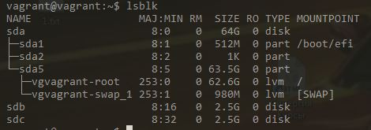
		
		
4.  __Используя fdisk, разбейте первый диск на 2 раздела: 2 Гб, оставшееся пространство.__
	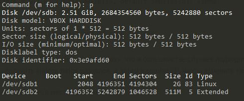
5.	__Используя sfdisk, перенесите данную таблицу разделов на второй диск.__
	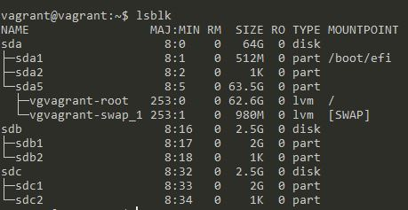
6.	__Соберите mdadm RAID1 на паре разделов 2 Гб.__

	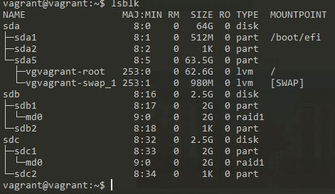
7.	__Соберите mdadm RAID0 на второй паре маленьких разделов.__
8.	
	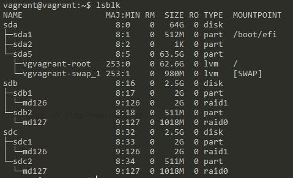
8.	__Создайте 2 независимых PV на получившихся md-устройствах.__

	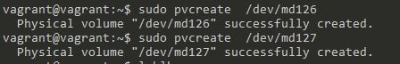
9.	__Создайте общую volume-group на этих двух PV.__

	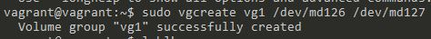
	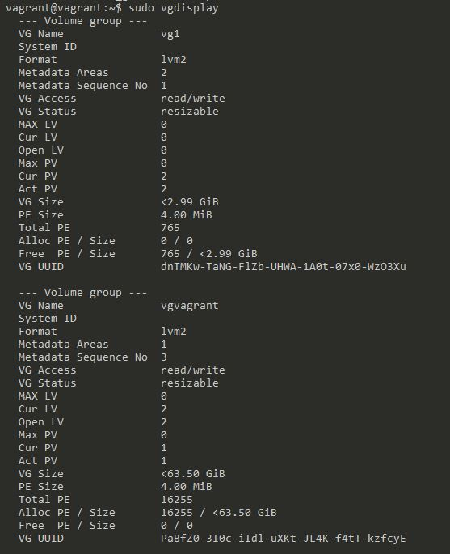
10.	__Создайте LV размером 100 Мб, указав его расположение на PV с RAID0.__
	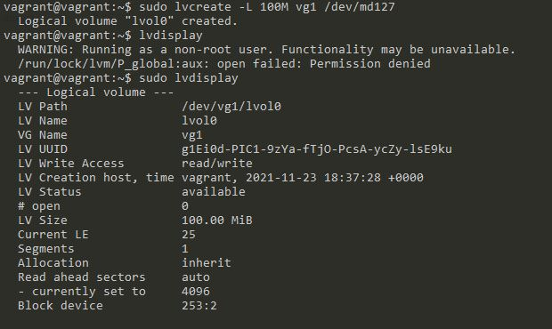
11.	__Создайте mkfs.ext4 ФС на получившемся LV.__

	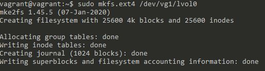
12.	__Смонтируйте этот раздел в любую директорию, например, /tmp/new.__
	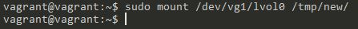
13.	__Поместите туда тестовый файл, например wget https://mirror.yandex.ru/ubuntu/ls-lR.gz -O /tmp/new/test.gz__

	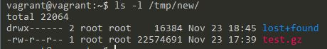
14.	__Прикрепите вывод lsblk.__

	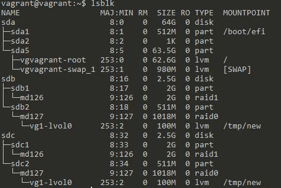
15.	__Протестируйте целостность файла:__
		__root@vagrant:~# gzip -t /tmp/new/test.gz__
		__root@vagrant:~# echo $?__
		__0__
	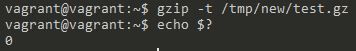
16.	__Используя pvmove, переместите содержимое PV с RAID0 на RAID1.__
	
17.	__Сделайте --fail на устройство в вашем RAID1 md.__

	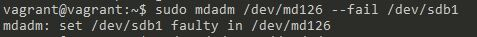
18.	__Подтвердите выводом dmesg, что RAID1 работает в деградированном состоянии.__
	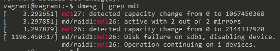
19.	__Протестируйте целостность файла, несмотря на "сбойный" диск он должен продолжать быть доступен:__
		__root@vagrant:~# gzip -t /tmp/new/test.gz__
		__root@vagrant:~# echo $?__
		__0__
		
	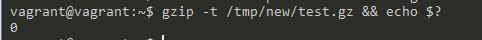
20.	__Погасите тестовый хост, vagrant destroy.__
