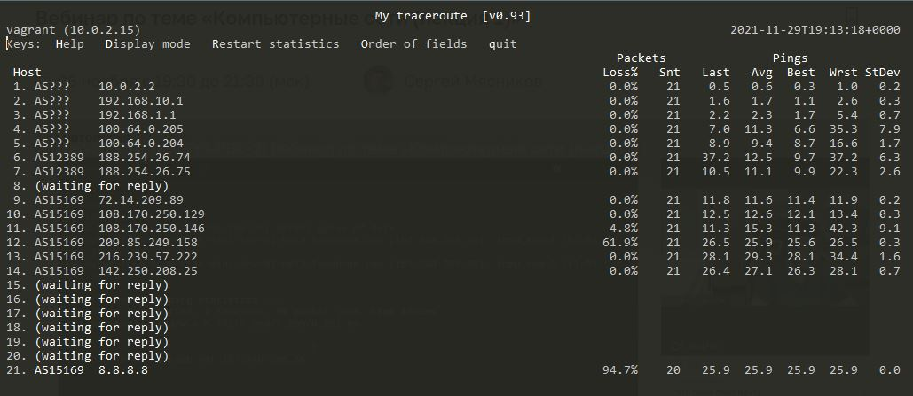

1.	Работа c HTTP через телнет.
-	Подключитесь утилитой телнет к сайту stackoverflow.com telnet stackoverflow.com 80
- 	отправьте HTTP запрос

		GET /questions HTTP/1.0
		HOST: stackoverflow.com
		[press enter]
		[press enter]
	В ответе укажите полученный HTTP код, что он означает - Проверка состояния HTTP.
	
		HTTP/1.1 301 Moved Permanently                                                                                          
		cache-control: no-cache, no-store, must-revalidate                                                                      
		location: https://stackoverflow.com/questions                                                                           
		x-request-guid: e16f3095-3bdf-4c92-959f-9d3a95f4eb5f                                                                    
		feature-policy: microphone 'none'; speaker 'none'                                                                       
		content-security-policy: upgrade-insecure-requests; frame-ancestors 'self' https://stackexchange.com                    
		Accept-Ranges: bytes                                                                                                    
		Date: Mon, 29 Nov 2021 18:11:09 GMT                                                                                     
		Via: 1.1 varnish                                                                                                        
		Connection: close                                                                                                       
		X-Served-By: cache-fra19127-FRA                                                                                         
		X-Cache: MISS                                                                                                           
		X-Cache-Hits: 0                                                                                                         
		X-Timer: S1638209469.461872,VS0,VE92                                                                                    
		Vary: Fastly-SSL                                                                                                        
		X-DNS-Prefetch-Control: off                                                                                             
		Set-Cookie: prov=7d8b7bb7-bf91-473c-99e1-94eac4950ff0; domain=.stackoverflow.com; expires=Fri, 01-Jan-2055 00:00:00 GMT;
		 path=/; HttpOnly                                                                                                       
	
	
2.	Повторите задание 1 в браузере, используя консоль разработчика F12.
	откройте вкладку Network
	отправьте запрос http://stackoverflow.com
	найдите первый ответ HTTP сервера, откройте вкладку Headers
	укажите в ответе полученный HTTP код.
	
		Request URL: https://stackoverflow.com/
		Request Method: GET
		Status Code: 200 
		Remote Address: 151.101.193.69:443
		Referrer Policy: strict-origin-when-cross-origin
	
	проверьте время загрузки страницы, какой запрос обрабатывался дольше всего?
	приложите скриншот консоли браузера в ответ.
	
1.	Какой IP адрес у вас в интернете?

		81.177.126.28
1.	Какому провайдеру принадлежит ваш IP адрес? Какой автономной системе AS? Воспользуйтесь утилитой whois

		[Ростелеком/AS12389
		vagrant@vagrant:~$ whois -h whois.radb.net 81.177.126.28
		route:          81.177.126.0/24
		descr:          ROSTELECOM NETS
		origin:         AS12389
		mnt-by:         ROSTELECOM-MNT
		created:        2017-04-18T07:53:32Z
		last-modified:  2017-04-18T07:53:32Z
		source:         RIPE
		remarks:        ****************************
		remarks:        * THIS OBJECT IS MODIFIED
		remarks:        * Please note that all data that is generally regarded as personal
		remarks:        * data has been removed from this object.
		remarks:        * To view the original object, please query the RIPE Database at:
		remarks:        * http://www.ripe.net/whois
		remarks:        ****************************]
	
1.	Через какие сети проходит пакет, отправленный с вашего компьютера на адрес 8.8.8.8? Через какие AS? Воспользуйтесь утилитой traceroute

	
1.	Повторите задание 5 в утилите mtr. На каком участке наибольшая задержка - delay?
	
1.	Какие DNS сервера отвечают за доменное имя dns.google? Какие A записи? воспользуйтесь утилитой dig
	
1.	Проверьте PTR записи для IP адресов из задания 7. Какое доменное имя привязано к IP? воспользуйтесь утилитой dig
	
