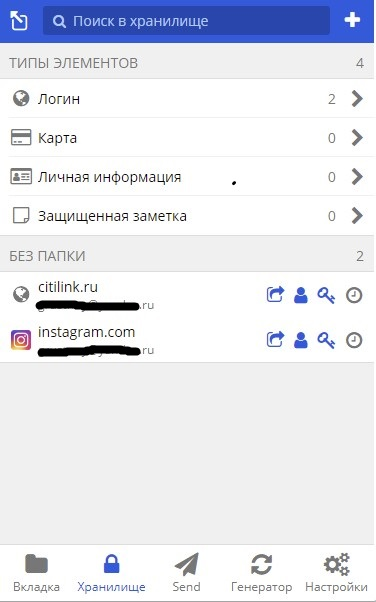
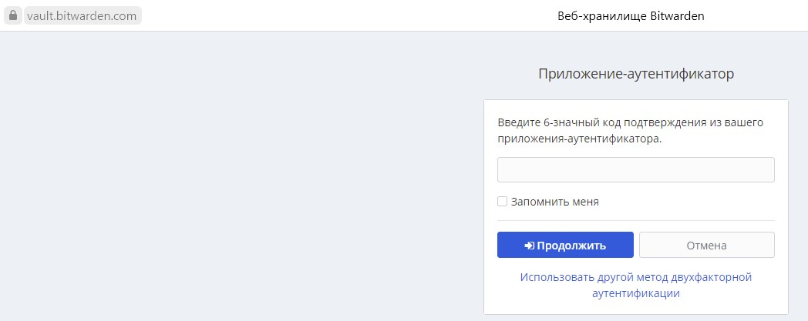
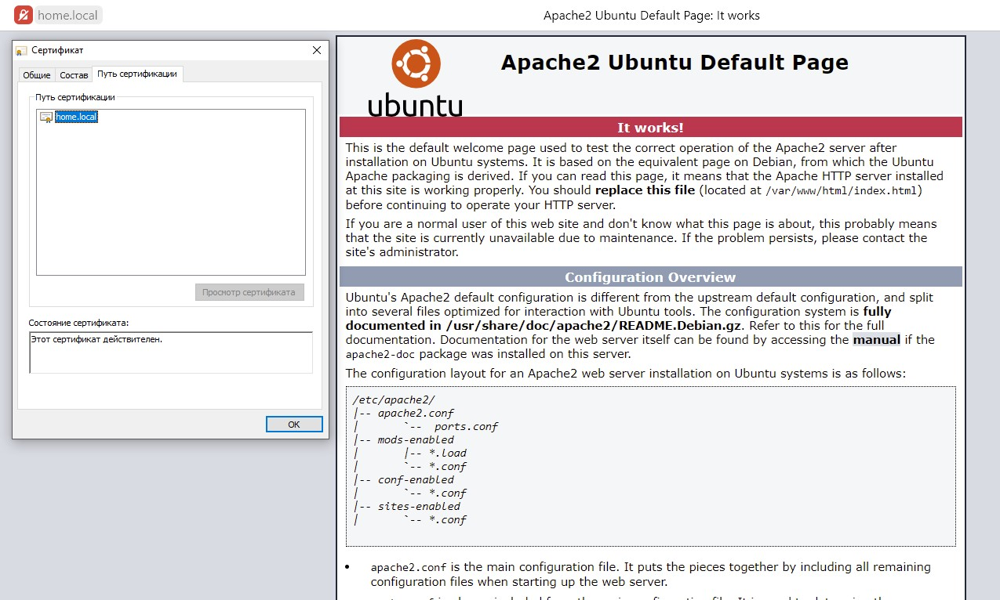
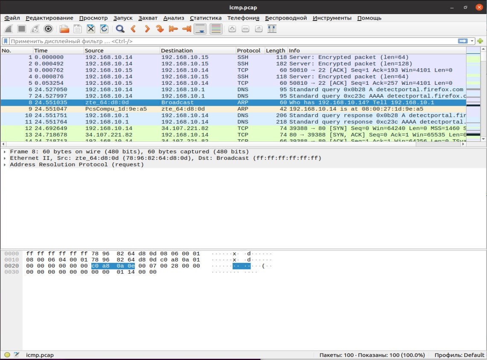

# Домашнее задание к занятию "3.9. Элементы безопасности информационных систем"

1. Установите Bitwarden плагин для браузера. Зарегистрируйтесь и сохраните несколько паролей.
	
	
	
2. Установите Google authenticator на мобильный телефон. Настройте вход в Bitwarden акаунт через Google authenticator OTP.

	

3. Установите apache2, сгенерируйте самоподписанный сертификат, настройте тестовый сайт для работы по HTTPS.
```
grustnuy@VB2:~$sudo apt install apache2sudo
grustnuy@VB2:~$sudo a2enmod ssl
```
- Генерируем сертификат:
```
root@VB2:/etc/apache2# openssl req -new -x509 -days 365 -nodes -out /etc/ssl/certs_home_cert.pem
-keyout /etc/ssl/private/home_cert.key -subj "/C=RU/ST=Moscow/L=Moscow/O=Global Name/OU=Org/CN=home.local"
Generating a RSA private key
.......................+++++
.......................+++++
writing new private key to '/etc/ssl/private/home_cert.key'

```

- Настройка Apache на https:
```
<VirtualHost *:443>
ServerName home.local
ServerAlias www.home.local
ServerAdmin webmaster@localhost
DocumentRoot /var/www/html/
SSLEngine on
SSLCertificateFile /etc/ssl/certs/home_cert.pem
SSLCertificateKeyFile /etc/ssl/private/home_cert.key
ErrorLog ${APACHE_LOG_DIR}/error.log
CustomLog ${APACHE_LOG_DIR}/access.log combined
</VirtualHost>
```



4. Проверьте на TLS уязвимости произвольный сайт в интернете (кроме сайтов МВД, ФСБ, МинОбр, НацБанк, РосКосмос, РосАтом, РосНАНО и любых госкомпаний, объектов КИИ, ВПК ... и тому подобное).
```
Testing vulnerabilities

 Heartbleed (CVE-2014-0160)                not vulnerable (OK), no heartbeat extension
 CCS (CVE-2014-0224)                       not vulnerable (OK)
 Ticketbleed (CVE-2016-9244), experiment.  not vulnerable (OK)
 ROBOT                                     not vulnerable (OK)
 Secure Renegotiation (RFC 5746)           supported (OK)
 Secure Client-Initiated Renegotiation     not vulnerable (OK)
 CRIME, TLS (CVE-2012-4929)                not vulnerable (OK)
 BREACH (CVE-2013-3587)                    potentially NOT ok, "gzip" HTTP compression detected. - only supplied "/" tested
                                           Can be ignored for static pages or if no secrets in the page
 POODLE, SSL (CVE-2014-3566)               not vulnerable (OK)
 TLS_FALLBACK_SCSV (RFC 7507)              No fallback possible (OK), no protocol below TLS 1.2 offered
 SWEET32 (CVE-2016-2183, CVE-2016-6329)    not vulnerable (OK)
 FREAK (CVE-2015-0204)                     not vulnerable (OK)
 DROWN (CVE-2016-0800, CVE-2016-0703)      not vulnerable on this host and port (OK)
                                           make sure you don't use this certificate elsewhere with SSLv2 enabled services
                                           https://censys.io/ipv4?q=BF97DC1B282F042C2EFFF358BF5B28AEACE104A0C2BD84D582E246C1A5C8D40C could help you to find out
 LOGJAM (CVE-2015-4000), experimental      not vulnerable (OK): no DH EXPORT ciphers, no DH key detected with <= TLS 1.2
 BEAST (CVE-2011-3389)                     not vulnerable (OK), no SSL3 or TLS1
 LUCKY13 (CVE-2013-0169), experimental     potentially VULNERABLE, uses cipher block chaining (CBC) ciphers with TLS. Check patches
 Winshock (CVE-2014-6321), experimental    not vulnerable (OK)
 RC4 (CVE-2013-2566, CVE-2015-2808)        no RC4 ciphers detected (OK)


 Done 2021-12-08 18:18:21 [  46s] -->> 31.31.196.60:443 (www.globus-stal.ru) <<--
```
5. Установите на Ubuntu ssh сервер, сгенерируйте новый приватный ключ. Скопируйте свой публичный ключ на другой сервер. Подключитесь к серверу по SSH-ключу.
```
grustnuy@VB2:~$ sudo apt install openssh-server
grustnuy@VB2:~$ systemctl start ssh
grustnuy@VB2:~$ systemctl enable ssh
Synchronizing state of ssh.service with SysV service script with /lib/systemd/systemd-sysv-install.
Executing: /lib/systemd/systemd-sysv-install enable ssh
```

- Генерируем ключ:
```
grustnuy@VB2:~/.ssh$ ssh-keygen
Generating public/private rsa key pair.
Enter file in which to save the key (/home/grustnuy/.ssh/id_rsa): /home/grustnuy/.ssh/id_rsa
Enter passphrase (empty for no passphrase):
Enter same passphrase again:
Your identification has been saved in /home/grustnuy/.ssh/id_rsa
Your public key has been saved in /home/grustnuy/.ssh/id_rsa.pub
The key fingerprint is:
SHA256:+nGkyeVjNZ9HheHvlkLNWxi7Av0fDEm4/8+0/H6ACU8 grustnuy@VB2
The key's randomart image is:
+---[RSA 3072]----+
|              .  |
|            .. o |
|           . .+ .|
|          ..E +=.|
|        S +=+*oo+|
|       o * o*++=+|
|      . = = .o=*=|
|       . + . .+*+|
|        .      =X|
+----[SHA256]-----+
```
- Копируем на сервер:
```
grustnuy@VB2:~/.ssh$ ssh-copy-id grustnuy@192.168.10.17
The authenticity of host '192.168.10.17 (192.168.10.17)' can't be established.
ECDSA key fingerprint is SHA256:uRxyM5wPc7crnk+yRcImt+XDCukskIVw++cbD+UqsGY.
Are you sure you want to continue connecting (yes/no/[fingerprint])? yes
/usr/bin/ssh-copy-id: INFO: attempting to log in with the new key(s), to filter out any that are already installed
/usr/bin/ssh-copy-id: INFO: 1 key(s) remain to be installed -- if you are prompted now it is to install the new keys
grustnuy@192.168.10.17's password:

Number of key(s) added: 1

Now try logging into the machine, with:   "ssh 'grustnuy@192.168.10.17'"
and check to make sure that only the key(s) you wanted were added.
```
- Подключаемся по ssh:

```
grustnuy@VB2:~/.ssh$ ssh grustnuy@192.168.10.17
Welcome to Ubuntu 20.04.3 LTS (GNU/Linux 5.11.0-46-generic x86_64)

 * Documentation:  https://help.ubuntu.com
 * Management:     https://landscape.canonical.com
 * Support:        https://ubuntu.com/advantage

1 update can be applied immediately.
Чтобы просмотреть дополнительные обновления выполните: apt list --upgradable

Your Hardware Enablement Stack (HWE) is supported until April 2025.
Last login: Sun Jan 16 22:05:25 2022 from 192.168.10.15
```
6. Переименуйте файлы ключей из задания 5. Настройте файл конфигурации SSH клиента, так чтобы вход на удаленный сервер осуществлялся по имени сервера.
```
grustnuy@VB2:~/.ssh$ ls
id_rsa  id_rsa.pub  known_hosts
grustnuy@VB2:~/.ssh$ mv id_rsa privat_key
grustnuy@VB2:~/.ssh$ mv id_rsa.pub public_key.pub
grustnuy@VB2:~/.ssh$ ls
known_hosts  privat_key  public_key.pub
```

- Настройте файл конфигурации SSH клиента:
``` 
Host vault-serv
  HostName 192.168.10.17
  IdentityFile ~/.ssh/publc_key.pub
  User grustnuy
  #Port 2222
  #StrictHostKeyChecking noHost *
  #User default_usernam
  #IdentityFile ~/.ssh/id_rsa
  #Protocol 2
```

- Подключение:
```
grustnuy@VB2:~/.ssh$ ssh vault-serv
Welcome to Ubuntu 20.04.3 LTS (GNU/Linux 5.11.0-46-generic x86_64)

 * Documentation:  https://help.ubuntu.com
 * Management:     https://landscape.canonical.com
 * Support:        https://ubuntu.com/advantage

1 update can be applied immediately.
Чтобы просмотреть дополнительные обновления выполните: apt list --upgradable

Your Hardware Enablement Stack (HWE) is supported until April 2025.
Last login: Mon Jan 17 22:07:28 2022 from 192.168.10.14
grustnuy@grustnuy-VB:~$
```

7. Соберите дамп трафика утилитой tcpdump в формате pcap, 100 пакетов. Откройте файл pcap в Wireshark.

```
grustnuy@VB2:~$ sudo tcpdump -c 100 -w icmp.pcap
[sudo] пароль для grustnuy:
tcpdump: listening on enp0s3, link-type EN10MB (Ethernet), capture size 262144 bytes
100 packets captured
134 packets received by filter
0 packets dropped by kernel
```




                                
