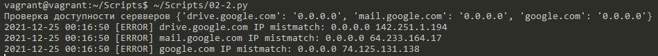

#Домашнее задание к занятию "4.2. Использование Python для решения типовых DevOps задач"

## Обязательная задача 1

Есть скрипт:
```python
#!/usr/bin/env python3
a = 1
b = '2'
c = a + b
```

### Вопросы:
| Вопрос  | Ответ |
| ------------- | ------------- |
| Какое значение будет присвоено переменной `c`?  | TypeError: unsupported operand type(s) for +: 'int' and 'str' Нельзя складывать строки и числа  |
| Как получить для переменной `c` значение 12?  | a = str("1") задать для a строковый тип  |
| Как получить для переменной `c` значение 3?  | b = 2 задать для b числовой тип  |

## Обязательная задача 2
Мы устроились на работу в компанию, где раньше уже был DevOps Engineer. Он написал скрипт, позволяющий узнать, какие файлы модифицированы в репозитории, относительно локальных изменений. Этим скриптом недовольно начальство, потому что в его выводе есть не все изменённые файлы, а также непонятен полный путь к директории, где они находятся. Как можно доработать скрипт ниже, чтобы он исполнял требования вашего руководителя?

```python
#!/usr/bin/env python3

import os

bash_command = ["cd ~/netology/sysadm-homeworks", "git status"]
result_os = os.popen(' && '.join(bash_command)).read()
is_change = False
for result in result_os.split('\n'):
    if result.find('modified') != -1:
        prepare_result = result.replace('\tmodified:   ', '')
        print(prepare_result)
        break
```

### Ваш скрипт:
```python
#!/usr/bin/env python3

import os

bash_command = ["cd ~/netology", "git status"]
result_os = os.popen(' && '.join(bash_command)).read()
for result in result_os.split('\n'):
    if result.find('modified') != -1:
        prepare_result = result.replace('\tmodified: ', '').strip()
        print(prepare_result)
```

### Вывод скрипта при запуске при тестировании:
```

```

## Обязательная задача 3
1. Доработать скрипт выше так, чтобы он мог проверять не только локальный репозиторий в текущей директории, а также умел воспринимать путь к репозиторию, который мы передаём как входной параметр. Мы точно знаем, что начальство коварное и будет проверять работу этого скрипта в директориях, которые не являются локальными репозиториями.

### Ваш скрипт:
```python
#!/usr/bin/env python3

import os
import sys

a = os.getcwd()

if len(sys.argv)>=2:
    a = sys.argv[1]
bash_command = ["cd "+a, "git status 2>&1"]

print('\033[31m')
result_os = os.popen(' && '.join(bash_command)).read()
for result in result_os.split('\n'):
    if result.find('fatal') != -1:
        print('\033[31m Каталог \033[1m '+a+'\033[0m\033[31m не является GIT репозиторием\033[0m')
    if result.find('modified') != -1:
        prepare_result = result.replace('\tmodified: ', '').strip()
        print(a+prepare_result)
print('\033[0m')
```

### Вывод скрипта при запуске при тестировании:
```

```

## Обязательная задача 4
1. Наша команда разрабатывает несколько веб-сервисов, доступных по http. Мы точно знаем, что на их стенде нет никакой балансировки, кластеризации, за DNS прячется конкретный IP сервера, где установлен сервис. Проблема в том, что отдел, занимающийся нашей инфраструктурой очень часто меняет нам сервера, поэтому IP меняются примерно раз в неделю, при этом сервисы сохраняют за собой DNS имена. Это бы совсем никого не беспокоило, если бы несколько раз сервера не уезжали в такой сегмент сети нашей компании, который недоступен для разработчиков. Мы хотим написать скрипт, который опрашивает веб-сервисы, получает их IP, выводит информацию в стандартный вывод в виде: <URL сервиса> - <его IP>. Также, должна быть реализована возможность проверки текущего IP сервиса c его IP из предыдущей проверки. Если проверка будет провалена - оповестить об этом в стандартный вывод сообщением: [ERROR] <URL сервиса> IP mismatch: <старый IP> <Новый IP>. Будем считать, что наша разработка реализовала сервисы: `drive.google.com`, `mail.google.com`, `google.com`.

### Ваш скрипт:
```python
#!/usr/bin/env python3

import socket
import time
import datetime

i = 1
wait = 2
serv = {'drive.google.com':'0.0.0.0', 'mail.google.com':'0.0.0.0', 'google.com':'0.0.0.0'}
init=0

print('Проверка доступности сервверов', serv)

while True :
  for host in serv:
    ip = socket.gethostbyname(host)
    if ip != serv[host]:
      if i==1 and init !=1:
        print(str(datetime.datetime.now().strftime("%Y-%m-%d %H:%M:%S")) +' [ERROR] ' + str(host) +' IP mistmatch: '+serv[host]+' '+ip)
      serv[host]=ip
```

### Вывод скрипта при запуске при тестировании:
```

```
