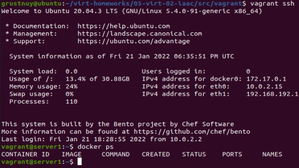

# Домашнее задание к занятию "5.2. Применение принципов IaaC в работе с виртуальными машинами"


## Задача 1

- Опишите своими словами основные преимущества применения на практике IaaC паттернов.
```
Ускорение процесса предоставления инфраструктуры для разработки,тестирования и масштабирования.Стабильность среды.
Более быстрая и эффективная разработка.
```
- Какой из принципов IaaC является основополагающим?
```
Идемпоте́нтность (лат.idem — тот же самый + potens — способный)—это свойство объекта или операции,
при повторном выполнении которой мы получаем результат идентичный предыдущему и всем последующим выполнениям.
```
## Задача 2

- Чем Ansible выгодно отличается от других систем управление конфигурациями?
```
Ansible использует существующую SSH инфраструктуру, в то время как другие (Saltstack, Chef, Puppet, и пр.)
требуют установки специального PKI-окружения.
```
- Какой, на ваш взгляд, метод работы систем конфигурации более надёжный push или pull?
```		
Они одинаково надежные так как отличаються лиш тем кто инициирует изменения конфигурации. 
```
## Задача 3

Установить на личный компьютер:

- VirtualBox 
```grustnuy@VB2:~/.ssh$ vboxmanage --version
6.1.26_Ubuntur145957
 ```
- Vagrant
```
grustnuy@VB2:~/.ssh$ vagrant --version
Vagrant 2.2.9
```
- Ansible 
```
grustnuy@VB2:~/.ssh$ ansible --version
ansible 2.9.6
  config file = /etc/ansible/ansible.cfg
  configured module search path = ['/home/grustnuy/.ansible/plugins/modules', '/usr/share/ansible/plugins/modules']
  ansible python module location = /usr/lib/python3/dist-packages/ansible
  executable location = /usr/bin/ansible
  python version = 3.8.10 (default, Nov 26 2021, 20:14:08) [GCC 9.3.0]
 ``` 
## Задача 4 (*)

Воспроизвести практическую часть лекции самостоятельно.




