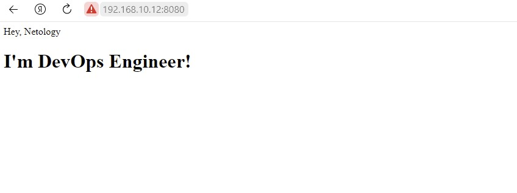

# Домашнее задание к занятию "5.3. Введение. Экосистема. Архитектура. Жизненный цикл Docker контейнера"

## Задача 1

Сценарий выполения задачи:

- создайте свой репозиторий на https://hub.docker.com;
- выберете любой образ, который содержит веб-сервер Nginx;
- создайте свой fork образа;
- реализуйте функциональность:
запуск веб-сервера в фоне с индекс-страницей, содержащей HTML-код ниже:
```
<html>
<head>
Hey, Netology
</head>
<body>
<h1>I’m DevOps Engineer!</h1>
</body>
</html>
```

```
vagrant@server1:~$ docker ps
CONTAINER ID   IMAGE     COMMAND                  CREATED             STATUS         PORTS                                   NAMES
b20a94a06fff   nginx     "/docker-entrypoint.…"   About an hour ago   Up 6 minutes   0.0.0.0:8080->80/tcp, :::8080->80/tcp   nginx

vagrant@server1:~$ vi index.html
vagrant@server1:~$ docker cp index.html b20a94a06fff:/usr/share/nginx/html
vagrant@server1:~$ docker restart b20a94a06fff
vagrant@server1:~$ docker exec -it nginx bash
vagrant@server1:~$ curl 192.168.10.12:8080
<!DOCTYPE html>
<html>
<head>
Hey, Netology
</head>
<body>
<h1>I’m DevOps Engineer!</h1>
</body>
</html>
```
  
```
vagrant@server1:~$ docker tag grustnuy/image:latest grustnuy/image:nginx_netology
vagrant@server1:~$ docker push grustnuy/image:nginx_netology
```
<https://hub.docker.com/r/grustnuy/image>

## Задача 2

Посмотрите на сценарий ниже и ответьте на вопрос:
"Подходит ли в этом сценарии использование Docker контейнеров или лучше подойдет виртуальная машина, физическая машина? Может быть возможны разные варианты?"

Сценарий | Условия использования |
|------|----------|
| Высоконагруженное монолитное java веб-приложение| Физический сервер, т.к. монолитное и высоконагруженное (необходим физический доступ к ресурсами) |
| Nodejs веб-приложение | Докер, в рамках микропроцессорной архитектуры хорошее решение |
| Мобильное приложение c версиями для Android и iOS | Виртуальная машина -  приложение в докере не имеет GUI, а это по описанию не подходит |
| Шина данных на базе Apache Kafka| Виртуальная машина/Физический сервер - при критичности данных | 
| Elasticsearch кластер для реализации логирования продуктивного веб-приложения - три ноды elasticsearch, два logstash и две ноды kibana| Докер |
| Мониторинг-стек на базе Prometheus и Grafana| Докер, т.к. нет требования к целостности данных + скорость развертывания |
| MongoDB, как основное хранилище данных для java-приложения | Виртуальная машина/Физический сервер, т.к. хранилище |
| Gitlab сервер для реализации CI/CD процессов и приватный (закрытый) Docker Registry | Виртуальная машина/Физический сервер |

## Задача 3

- Запустите первый контейнер из образа ***centos*** c любым тэгом в фоновом режиме, подключив папку ```/data``` из текущей рабочей директории на хостовой машине в ```/data``` контейнера;
```
vagrant@server1:~$ docker run -dti --name centos -v /data:/data centos
1e80a8eef5cf9b08f3c6c067ef6a1dba2caf3ec217e20fc47ae9d08cc7f63527
```
- Запустите второй контейнер из образа ***debian*** в фоновом режиме, подключив папку ```/data``` из текущей рабочей директории на хостовой машине в ```/data``` контейнера;
```
vagrant@server1:~$ docker run -dti --name debian -v /data:/data debian
348e39fe52a6c6309a5412fc0dafd25e9eada58603a3f8d0b8723bc049e20f48
```
- Подключитесь к первому контейнеру с помощью ```docker exec``` и создайте текстовый файл любого содержания в ```/data```;
```
vagrant@server1:~$ docker exec -it centos bash
[root@1e80a8eef5cf /]# cd data/
[root@1e80a8eef5cf data]# touch centos.txt
[root@1e80a8eef5cf data]# ls
centos.txt
```
- Добавьте еще один файл в папку ```/data``` на хостовой машине;
```
vagrant@server1:/home$ cd /data
vagrant@server1:~/data$ sudo touch vagrant.txt
```
- Подключитесь во второй контейнер и отобразите листинг и содержание файлов в ```/data``` контейнера.
```
vagrant@server1:/data$ docker exec -it debian bash
root@348e39fe52a6:/# cd data/
root@348e39fe52a6:/data# ls -l
total 0
-rw-r--r-- 1 root root 0 Jan 30 18:07 centos.txt
-rw-r--r-- 1 root root 0 Jan 30 18:14 vagrant.txt
```

## Задача 4 (*)

Воспроизвести практическую часть лекции самостоятельно.

Соберите Docker образ с Ansible, загрузите на Docker Hub и пришлите ссылку вместе с остальными ответами к задачам.

<https://hub.docker.com/r/grustnuy/image>
