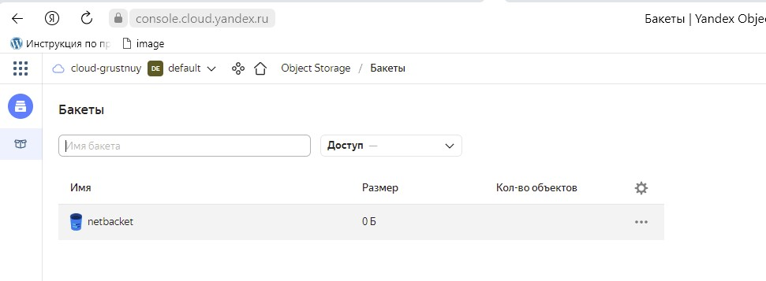

# Домашнее задание к занятию "7.3. Основы и принцип работы Терраформ"

## Задача 1. Создадим бэкэнд в S3 (необязательно, но крайне желательно).

Если в рамках предыдущего задания у вас уже есть аккаунт AWS, то давайте продолжим знакомство со взаимодействием
терраформа и aws. 

1. Создайте s3 бакет, iam роль и пользователя от которого будет работать терраформ. Можно создать отдельного пользователя,
а можно использовать созданного в рамках предыдущего задания, просто добавьте ему необходимы права, как описано 
[здесь](https://www.terraform.io/docs/backends/types/s3.html).
1. Зарегистрируйте бэкэнд в терраформ проекте как описано по ссылке выше. 

 Настраиваем провайдер:
 
 ```
nano ~/.terraformrc
provider_installation {
  network_mirror {
    url = "https://terraform-mirror.yandexcloud.net/"
    include = ["registry.terraform.io/*/*"]
  }
  direct {
    exclude = ["registry.terraform.io/*/*"]
  }
}
```
Создаем сервис-аккаунт:
```
grustnuy@ubuntu:~/terr/07-terraform-03-basic$ yc iam service-account create --name terraform
id: ajeq**********
folder_id: b1gs5**********
created_at: "2022-07-03T19:24:55.337386509Z"
name: terraform

There is a new yc version '0.91.0' available. Current version: '0.89.0'.
See release notes at https://cloud.yandex.ru/docs/cli/release-notes
You can install it by running the following command in your shell:
        $ yc components update
```

Назначаем роль сервис-аккаунту:
```
grustnuy@ubuntu:~/terr/07-terraform-03-basic$ yc resource-manager folder add-access-binding b1gs5df19o96tmgil3jn --role editor --subject serviceAccount:ajeqrhltcul77hcnl2s3
done (1s)
```

Создаем ключ доступа:
```
grustnuy@ubuntu:~/terr/07-terraform-03-basic$ yc iam access-key create --service-account-name terraform
access_key:
  id: ajee***********
  service_account_id: ajeqr*************
  created_at: "2022-07-03T19:29:32.436568559Z"
  key_id: YCAJ***********
secret: YCMAk**************
```



## Задача 2. Инициализируем проект и создаем воркспейсы. 

1. Выполните `terraform init`:

```
grustnuy@ubuntu:~/terr/07-terraform-03-basic$ sudo terraform init

Initializing the backend...

Initializing provider plugins...
- Finding latest version of yandex-cloud/yandex...
- Installing yandex-cloud/yandex v0.76.0...
- Installed yandex-cloud/yandex v0.76.0 (self-signed, key ID E40F590B50BB8E40)

Partner and community providers are signed by their developers.
If you'd like to know more about provider signing, you can read about it here:
https://www.terraform.io/docs/cli/plugins/signing.html

Terraform has created a lock file .terraform.lock.hcl to record the provider
selections it made above. Include this file in your version control repository
so that Terraform can guarantee to make the same selections by default when
you run "terraform init" in the future.

Terraform has been successfully initialized!

You may now begin working with Terraform. Try running "terraform plan" to see
any changes that are required for your infrastructure. All Terraform commands
should now work.

If you ever set or change modules or backend configuration for Terraform,
rerun this command to reinitialize your working directory. If you forget, other
commands will detect it and remind you to do so if necessary.
```

`Выполняем apply`

```
grustnuy@ubuntu:~/terr/07-terraform-03-basic$ sudo terraform apply

yandex_vpc_network.network-1: Creating...
yandex_vpc_network.network-1: Creation complete after 2s [id=enpg5qdcttrr5j6lots4]
yandex_vpc_subnet.subnet-1: Creating...
yandex_vpc_subnet.subnet-1: Creation complete after 1s [id=e9bh455vjc8mibtqe4hk]
yandex_compute_instance.vm-1: Creating...
yandex_compute_instance.vm-1: Still creating... [10s elapsed]
yandex_compute_instance.vm-1: Still creating... [20s elapsed]
yandex_compute_instance.vm-1: Creation complete after 23s [id=fhm2dme00j2sss81to44]

Apply complete! Resources: 3 added, 0 changed, 0 destroyed.

```

      
1. Создайте два воркспейса `stage` и `prod`.

```
grustnuy@ubuntu:~/terr/07-terraform-03-basic$ terraform workspace new stage
Created and switched to workspace "stage"!

You're now on a new, empty workspace. Workspaces isolate their state,
so if you run "terraform plan" Terraform will not see any existing state
for this configuration.
grustnuy@ubuntu:~/terr/07-terraform-03-basic$ terraform workspace new prod
Created and switched to workspace "prod"!

You're now on a new, empty workspace. Workspaces isolate their state,
so if you run "terraform plan" Terraform will not see any existing state
for this configuration.

grustnuy@ubuntu:~/terr/07-terraform-03-basic$ terraform workspace list
  default
  prod
* stage
```

1. В уже созданный `aws_instance` добавьте зависимость типа инстанса от вокспейса, что бы в разных ворскспейсах 
использовались разные `instance_type`.

```
locals {
  is_prod = terraform.workspace == "prod"
  memory_map = {
    default  = 4
    prod     = 8
    stage    = 2
  }
}

resource "yandex_compute_instance" "vm" {
  ...
  resources {
    cores  = local.is_prod ? 4 : 2
    memory = local.memory_map[terraform.workspace]
  }
```

1. Добавим `count`. Для `stage` должен создаться один экземпляр `ec2`, а для `prod` два. 

```
resource "yandex_compute_instance" "site-vm" {
  zone      = var.yandex_zone
  allow_stopping_for_update = true
  count     = local.is_prod ? 2 : 1
``` 
1. Создайте рядом еще один `aws_instance`, но теперь определите их количество при помощи `for_each`, а не `count`.

```
locals {
  is_prod = terraform.workspace == "prod"
  memory_map = {
    default  = 4
    prod     = 8
    stage    = 2
  }
  monitoring_map = {
    prod     = ["m1"]
    stage    = []
  }
}

...

resource "yandex_compute_instance" "vm-2" {
  for_each  = toset( local.monitoring_map[terraform.workspace] )
  zone      = var.yandex_zone
  allow_stopping_for_update = true
  
  resources {
    cores  = 2
    memory = 2
  }

```
1. Что бы при изменении типа инстанса не возникло ситуации, когда не будет ни одного инстанса добавьте параметр
жизненного цикла `create_before_destroy = true` в один из рессурсов `aws_instance`.

```
lifecycle {
    create_before_destroy = true
  }
```

1. При желании поэкспериментируйте с другими параметрами и рессурсами.

В виде результата работы пришлите:
* Вывод команды `terraform workspace list`.
```
grustnuy@ubuntu:~/terr/07-terraform-03-basic$ terraform workspace list
  default
* prod
  stage
```
* Вывод команды `terraform plan` для воркспейса `prod`.  
```
grustnuy@ubuntu:~/terr/07-terraform-03-basic$ terraform plan

Terraform used the selected providers to generate the following execution plan. Resource actions are indicated with the following symbols:
  + create

Terraform will perform the following actions:

  # yandex_compute_instance.vm[0] will be created
  + resource "yandex_compute_instance" "vm" {
      + allow_stopping_for_update = true
      + created_at                = (known after apply)
      + folder_id                 = (known after apply)
      + fqdn                      = (known after apply)
      + hostname                  = (known after apply)
      + id                        = (known after apply)
      + metadata                  = {
          + "ssh-keys" = <<-EOT
                ubuntu:ssh-rsa AAAAB3NzaC1yc2EAAAADiCYy/Q8kNvVOQ4mR/SUCjT4AX grustnuy@DESKTOP-M9GD4QV
            EOT
        }
      + network_acceleration_type = "standard"
      + platform_id               = "standard-v1"
      + service_account_id        = (known after apply)
      + status                    = (known after apply)
      + zone                      = "ru-central1-a"

      + boot_disk {
          + auto_delete = true
          + device_name = (known after apply)
          + disk_id     = (known after apply)
          + mode        = (known after apply)

          + initialize_params {
              + block_size  = (known after apply)
              + description = (known after apply)
              + image_id    = "fd8mfc6omiki5govl68h"
              + name        = (known after apply)
              + size        = 20
              + snapshot_id = (known after apply)
              + type        = "network-nvme"
            }
        }

      + network_interface {
          + index              = (known after apply)
          + ip_address         = (known after apply)
          + ipv4               = true
          + ipv6               = (known after apply)
          + ipv6_address       = (known after apply)
          + mac_address        = (known after apply)
          + nat                = true
          + nat_ip_address     = (known after apply)
          + nat_ip_version     = (known after apply)
          + security_group_ids = (known after apply)
          + subnet_id          = (known after apply)
        }

      + placement_policy {
          + host_affinity_rules = (known after apply)
          + placement_group_id  = (known after apply)
        }

      + resources {
          + core_fraction = 100
          + cores         = 4
          + memory        = 8
        }

      + scheduling_policy {
          + preemptible = (known after apply)
        }
    }

  # yandex_compute_instance.vm[1] will be created
  + resource "yandex_compute_instance" "vm" {
      + allow_stopping_for_update = true
      + created_at                = (known after apply)
      + folder_id                 = (known after apply)
      + fqdn                      = (known after apply)
      + hostname                  = (known after apply)
      + id                        = (known after apply)
      + metadata                  = {
          + "ssh-keys" = <<-EOT
                ubuntu:ssh-rsa AAAAB3NzaC1yc2EAAAADiCYy/Q8kNvVOQ4mR/SUCjT4AX grustnuy@DESKTOP-M9GD4QV
            EOT
        }
      + network_acceleration_type = "standard"
      + platform_id               = "standard-v1"
      + service_account_id        = (known after apply)
      + status                    = (known after apply)
      + zone                      = "ru-central1-a"

      + boot_disk {
          + auto_delete = true
          + device_name = (known after apply)
          + disk_id     = (known after apply)
          + mode        = (known after apply)

          + initialize_params {
              + block_size  = (known after apply)
              + description = (known after apply)
              + image_id    = "fd8mfc6omiki5govl68h"
              + name        = (known after apply)
              + size        = 20
              + snapshot_id = (known after apply)
              + type        = "network-nvme"
            }
        }

      + network_interface {
          + index              = (known after apply)
          + ip_address         = (known after apply)
          + ipv4               = true
          + ipv6               = (known after apply)
          + ipv6_address       = (known after apply)
          + mac_address        = (known after apply)
          + nat                = true
          + nat_ip_address     = (known after apply)
          + nat_ip_version     = (known after apply)
          + security_group_ids = (known after apply)
          + subnet_id          = (known after apply)
        }

      + placement_policy {
          + host_affinity_rules = (known after apply)
          + placement_group_id  = (known after apply)
        }

      + resources {
          + core_fraction = 100
          + cores         = 4
          + memory        = 8
        }

      + scheduling_policy {
          + preemptible = (known after apply)
        }
    }

  # yandex_compute_instance.vm-2["m1"] will be created
  + resource "yandex_compute_instance" "vm-2" {
      + allow_stopping_for_update = true
      + created_at                = (known after apply)
      + folder_id                 = (known after apply)
      + fqdn                      = (known after apply)
      + hostname                  = (known after apply)
      + id                        = (known after apply)
      + metadata                  = {
          + "ssh-keys" = <<-EOT
                ubuntu:ssh-rsa AAAAB3NzaC1yc2EAAAADiCYy/Q8kNvVOQ4mR/SUCjT4AX grustnuy@DESKTOP-M9GD4QV
            EOT
        }
      + network_acceleration_type = "standard"
      + platform_id               = "standard-v1"
      + service_account_id        = (known after apply)
      + status                    = (known after apply)
      + zone                      = "ru-central1-a"

      + boot_disk {
          + auto_delete = true
          + device_name = (known after apply)
          + disk_id     = (known after apply)
          + mode        = (known after apply)

          + initialize_params {
              + block_size  = (known after apply)
              + description = (known after apply)
              + image_id    = "fd8mfc6omiki5govl68h"
              + name        = (known after apply)
              + size        = 10
              + snapshot_id = (known after apply)
              + type        = "network-nvme"
            }
        }

      + network_interface {
          + index              = (known after apply)
          + ip_address         = (known after apply)
          + ipv4               = true
          + ipv6               = (known after apply)
          + ipv6_address       = (known after apply)
          + mac_address        = (known after apply)
          + nat                = true
          + nat_ip_address     = (known after apply)
          + nat_ip_version     = (known after apply)
          + security_group_ids = (known after apply)
          + subnet_id          = (known after apply)
        }

      + placement_policy {
          + host_affinity_rules = (known after apply)
          + placement_group_id  = (known after apply)
        }

      + resources {
          + core_fraction = 100
          + cores         = 2
          + memory        = 2
        }

      + scheduling_policy {
          + preemptible = (known after apply)
        }
    }

  # yandex_vpc_network.network-1 will be created
  + resource "yandex_vpc_network" "network-1" {
      + created_at                = (known after apply)
      + default_security_group_id = (known after apply)
      + folder_id                 = (known after apply)
      + id                        = (known after apply)
      + labels                    = (known after apply)
      + name                      = "network1"
      + subnet_ids                = (known after apply)
    }

  # yandex_vpc_subnet.subnet-1 will be created
  + resource "yandex_vpc_subnet" "subnet-1" {
      + created_at     = (known after apply)
      + folder_id      = (known after apply)
      + id             = (known after apply)
      + labels         = (known after apply)
      + name           = "subnet1"
      + network_id     = (known after apply)
      + v4_cidr_blocks = [
          + "192.168.10.0/24",
        ]
      + v6_cidr_blocks = (known after apply)
      + zone           = "ru-central1-a"
    }

Plan: 5 to add, 0 to change, 0 to destroy.

Changes to Outputs:
  + external_ip_address_vm = [
      + (known after apply),
      + (known after apply),
    ]
  + internal_ip_address_vm = [
      + (known after apply),
      + (known after apply),
    ]

───────────────────────────────────────────────────────────────────────────────────────────────────────────────────────────────────────────────────────────────────────────────────────────────────────────────

Note: You didn't use the -out option to save this plan, so Terraform can't guarantee to take exactly these actions if you run "terraform apply" now.
```
