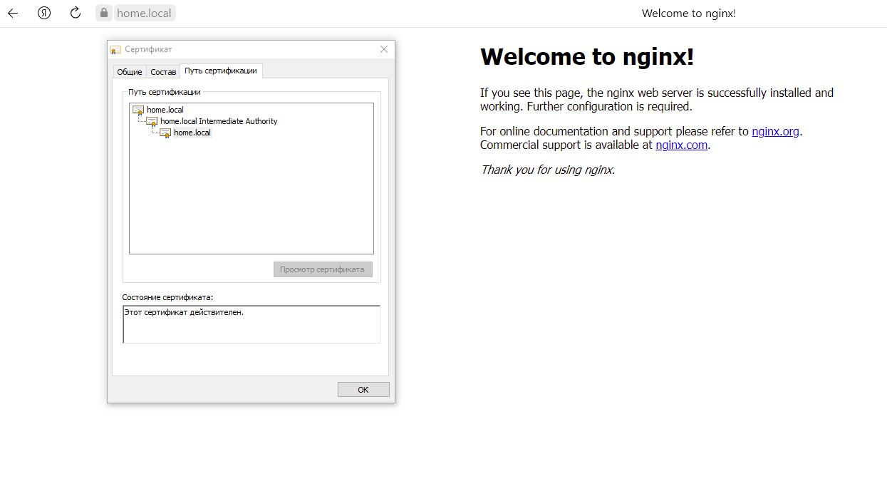

# Курсовая работа по итогам модуля "DevOps и системное администрирование"


## Задание

1. Создайте виртуальную машину Linux.
	```Создал.```
2. Установите ufw и разрешите к этой машине сессии на порты 22 и 443, при этом трафик на интерфейсе localhost (lo) должен ходить свободно на все порты.
```
	sudo apt install ufw
	grustnuy@grustnuy-VB:~$ sudo ufw status
	Состояние: неактивен
		
	sudo ufw default deny incoming
	sudo ufw default allow outgoing
	sudo ufw allow ssh 
	sudo ufw allow https 
	sudo ufw allow in on lo to any
	sudo ufw allow out on lo to any
	
	grustnuy@grustnuy-VB:~$ sudo ufw enable
	
```
```	
	grustnuy@grustnuy-VB:~$ sudo ufw status verbose
	Состояние: активен
	Журналирование: on (low)
	По умолчанию: deny (входящие), allow (исходящие), disabled (маршрутизированные)
	Новые профили: skip

	В                          Действие    Из
	-                          --------    --
	22/tcp                     ALLOW IN    Anywhere
	443/tcp                    ALLOW IN    Anywhere
	Anywhere on lo             ALLOW IN    Anywhere
	22/tcp (v6)                ALLOW IN    Anywhere (v6)
	443/tcp (v6)               ALLOW IN    Anywhere (v6)
	Anywhere (v6) on lo        ALLOW IN    Anywhere (v6)

	Anywhere                   ALLOW OUT   Anywhere on lo
	Anywhere (v6)              ALLOW OUT   Anywhere (v6) on lo

```	
	
	
3. Установите hashicorp vault ([инструкция по ссылке](https://learn.hashicorp.com/tutorials/vault/getting-started-install?in=vault/getting-started#install-vault)).

``` curl -fsSL https://apt.releases.hashicorp.com/gpg | sudo apt-key add -
	sudo apt-add-repository "deb [arch=amd64] https://apt.releases.hashicorp.com $(lsb_release -cs) main"
	sudo apt-get update && sudo apt-get install vault
	
	grustnuy@grustnuy-VB:~$ vault
	Usage: vault <command> [args]

	Common commands:
		read        Read data and retrieves secrets
		write       Write data, configuration, and secrets
		delete      Delete secrets and configuration
		list        List data or secrets
		login       Authenticate locally
		agent       Start a Vault agent
		server      Start a Vault server
		status      Print seal and HA status
		unwrap      Unwrap a wrapped secret

	Other commands:
		audit          Interact with audit devices
		auth           Interact with auth methods
		debug          Runs the debug command
		kv             Interact with Vault's Key-Value storage
		lease          Interact with leases
		monitor        Stream log messages from a Vault server
		namespace      Interact with namespaces
		operator       Perform operator-specific tasks
		path-help      Retrieve API help for paths
		plugin         Interact with Vault plugins and catalog
		policy         Interact with policies
		print          Prints runtime configurations
		secrets        Interact with secrets engines
		ssh            Initiate an SSH session
		token          Interact with tokens
```
	
4. Cоздайте центр сертификации по инструкции ([ссылка](https://learn.hashicorp.com/tutorials/vault/pki-engine?in=vault/secrets-management)) и выпустите сертификат для использования его в настройке веб-сервера nginx (срок жизни сертификата - месяц).

Устанавливаем пакет jq:
```	
sudo apt install jq	
```
Разрешаем автозапуск службы и если она не запущена, стартуем ее:
```	
systemctl enable vault --now
```
Проверяем статус:
```
	grustnuy@grustnuy-VB:~$ systemctl status vault
● vault.service - "HashiCorp Vault - A tool for managing secrets"
     Loaded: loaded (/lib/systemd/system/vault.service; enabled; vendor preset: enabled)
     Active: active (running) since Fri 2022-01-07 18:06:54 MSK; 13min ago
       Docs: https://www.vaultproject.io/docs/
   Main PID: 39701 (vault)
      Tasks: 8 (limit: 4637)
     Memory: 58.3M
     CGroup: /system.slice/vault.service
             └─39701 /usr/bin/vault server -config=/etc/vault.d/vault.hcl

янв 07 18:20:09 grustnuy-VB vault[39701]: 2022-01-07T18:20:09.459+0300 [INFO]  core: seal configuration missing, not initiali>
янв 07 18:20:19 grustnuy-VB vault[39701]: 2022-01-07T18:20:19.474+0300 [INFO]  core: security barrier not initialized
янв 07 18:20:19 grustnuy-VB vault[39701]: 2022-01-07T18:20:19.479+0300 [INFO]  core: security barrier not initialized
янв 07 18:20:19 grustnuy-VB vault[39701]: 2022-01-07T18:20:19.479+0300 [INFO]  core: seal configuration missing, not initiali>
янв 07 18:20:29 grustnuy-VB vault[39701]: 2022-01-07T18:20:29.492+0300 [INFO]  core: security barrier not initialized
янв 07 18:20:29 grustnuy-VB vault[39701]: 2022-01-07T18:20:29.501+0300 [INFO]  core: security barrier not initialized
янв 07 18:20:29 grustnuy-VB vault[39701]: 2022-01-07T18:20:29.502+0300 [INFO]  core: seal configuration missing, not initiali>
янв 07 18:20:39 grustnuy-VB vault[39701]: 2022-01-07T18:20:39.546+0300 [INFO]  core: security barrier not initialized
янв 07 18:20:39 grustnuy-VB vault[39701]: 2022-01-07T18:20:39.553+0300 [INFO]  core: security barrier not initialized
янв 07 18:20:39 grustnuy-VB vault[39701]: 2022-01-07T18:20:39.553+0300 [INFO]  core: seal configuration missing, not initiali>
```

Правим конфиг:
```
sudo vi /etc/vault.d/vault.hcl
listener "tcp" {
  address = "127.0.0.1:8282"
  tls_disable = 1
}
```	
Настраиваем хранилище:
```	
export VAULT_ADDR=http://127.0.0.1:8282

grustnuy@grustnuy-VB:~$ vault status
Key                Value
---                -----
Seal Type          shamir
Initialized        false
Sealed             true
Total Shares       0
Threshold          0
Unseal Progress    0/0
Unseal Nonce       n/a
Version            1.9.2
Storage Type       file
HA Enabled         false
```
Инициализируем хранилище:
```
vault operator init

grustnuy@grustnuy-VB:~$ vault operator init
Unseal Key 1: QQ2e7jeiL71mDPCdTeIn8lDGnVIL221XJvwCaU56oIVl
Unseal Key 2: TxiOfQpLzRJnp4SkMCZvTbvvo776+T7tojoVm0l02N3P
Unseal Key 3: YH/YBBoUVAsX/TTwob9ZguhwRhlsIdd8W5192tFgHMWz
Unseal Key 4: HVlgfb52LYJDhlryKEPhMdwfntpuyzkJ+HkpMVqvlxJO
Unseal Key 5: IVxEyKCYDbjS2K6FJgZGvn6D21aBYsH9fLHevpBFITzZ

Initial Root Token: s.7Lvqp5q8Hfd7QqBxXpKkpGM4

Vault initialized with 5 key shares and a key threshold of 3. Please securely
distribute the key shares printed above. When the Vault is re-sealed,
restarted, or stopped, you must supply at least 3 of these keys to unseal it
before it can start servicing requests.

Vault does not store the generated master key. Without at least 3 keys to
reconstruct the master key, Vault will remain permanently sealed!

It is possible to generate new unseal keys, provided you have a quorum of
existing unseal keys shares. See "vault operator rekey" for more information.
```
Распечатываем хранилище:
```
grustnuy@grustnuy-VB:~$ vault operator unseal QQ2e7jeiL71mDPCdTeIn8lDGnVIL221XJvwCaU56oIVl
Key                Value
---                -----
Seal Type          shamir
Initialized        true
Sealed             true
Total Shares       5
Threshold          3
Unseal Progress    1/3
Unseal Nonce       45ad4b5a-bd06-888a-f410-b96b45a8c366
Version            1.9.2
Storage Type       file
HA Enabled         false
grustnuy@grustnuy-VB:~$ vault operator unseal YH/YBBoUVAsX/TTwob9ZguhwRhlsIdd8W5192tFgHMWz
Key                Value
---                -----
Seal Type          shamir
Initialized        true
Sealed             true
Total Shares       5
Threshold          3
Unseal Progress    2/3
Unseal Nonce       45ad4b5a-bd06-888a-f410-b96b45a8c366
Version            1.9.2
Storage Type       file
HA Enabled         false
grustnuy@grustnuy-VB:~$ vault operator unseal IVxEyKCYDbjS2K6FJgZGvn6D21aBYsH9fLHevpBFITzZ
Key             Value
---             -----
Seal Type       shamir
Initialized     true
Sealed          false
Total Shares    5
Threshold       3
Version         1.9.2
Storage Type    file
Cluster Name    vault-cluster-dd8feee2
Cluster ID      ebedb274-1626-0981-b056-8bed1d0b0ebe
HA Enabled      false
```
Подключаемся:
```
grustnuy@grustnuy-VB:~$ vault login s.7Lvqp5q8Hfd7QqBxXpKkpGM4
Success! You are now authenticated. The token information displayed below
is already stored in the token helper. You do NOT need to run "vault login"
again. Future Vault requests will automatically use this token.

Key                  Value
---                  -----
token                s.7Lvqp5q8Hfd7QqBxXpKkpGM4
token_accessor       HovCv3tb0hc7g9wW1Kv5O9MB
token_duration       ∞
token_renewable      false
token_policies       ["root"]
identity_policies    []
policies             ["root"]
```
Создаем корневой сертификат:
```
vault secrets enable pki
vault secrets tune -max-lease-ttl=87600h pki
write=certificate pki/root/generate/internal common_name="home.local" ttl=87600h > CA_cert.crt
vault write pki/config/urls issuing_certificates="$VAULT_ADDR/v1/pki/ca" crl_distribution_points="$VAULT_ADDR/v1/pki/crl"
```
Создаем промежуточный сертификат:
```
vault secrets enable -path=pki_int pki
vault secrets tune -max-lease-ttl=43800h pki_int
vault write -format=json pki_int/intermediate/generate/internal common_name="home.local Intermediate Authority" | jq -r '.data.csr' > pki_intermediate.csr
vault write -format=json pki/root/sign-intermediate csr=@pki_intermediate.csr format=pem_bundle ttl="43800h"| jq -r '.data.certificate' > intermediate.cert.pem
vault write pki_int/intermediate/set-signed certificate=@intermediate.cert.pem
```
Создаем роль:
```
vault write pki_int/roles/home-dot-local allowed_domains="home.local" allow_bare_domains=true allow_subdomains=true max_ttl="720h"
```
Создаем сертификат для домена на месяц:
```
vault write -format=json pki_int/issue/home-dot-local common_name="home.local" ttl="720h" > home.local.raw.json
```

5. Установите корневой сертификат созданного центра сертификации в доверенные в хостовой системе.
```
grustnuy@grustnuy-VB:~$ sudo mv CA_cert.crt /usr/local/share/ca-certificates/CA_cert.crt
[sudo] пароль для grustnuy:
grustnuy@grustnuy-VB:~$ sudo update-ca-certificates
Updating certificates in /etc/ssl/certs...
rehash: warning: skipping CA_cert.pem,it does not contain exactly one certificate or CRL
1 added, 0 removed; done.
Running hooks in /etc/ca-certificates/update.d...
done.
```
6. Установите nginx.
```
grustnuy@grustnuy-VB:~$ systemctl status nginx
● nginx.service - A high performance web server and a reverse proxy server
     Loaded: loaded (/lib/systemd/system/nginx.service; enabled; vendor preset: enabled)
     Active: active (running) since Sat 2022-01-08 23:20:46 MSK; 42s ago
       Docs: man:nginx(8)
   Main PID: 5295 (nginx)
      Tasks: 3 (limit: 4637)
     Memory: 3.7M
     CGroup: /system.slice/nginx.service
             ├─5295 nginx: master process /usr/sbin/nginx -g daemon on; master_process on;
             ├─5296 nginx: worker process
             └─5297 nginx: worker process

янв 08 23:20:46 grustnuy-VB systemd[1]: Starting A high performance web server and a reverse proxy serve>
янв 08 23:20:46 grustnuy-VB systemd[1]: Started A high performance web server and a reverse proxy server.
```
7. По инструкции ([ссылка](https://nginx.org/en/docs/http/configuring_https_servers.html)) настройте nginx на https, используя ранее подготовленный сертификат:
  - можно использовать стандартную стартовую страницу nginx для демонстрации работы сервера;
  - можно использовать и другой html файл, сделанный вами;

Настройка nginx:
```
grustnuy@grustnuy-VB:/etc/nginx/sites-available$ sudo vi default  
  server {
        listen 443 ssl;

        root /var/www/html;
        index index.html index.nginx-debian.html;

        server_name home.local;

        ssl_protocols       TLSv1 TLSv1.1 TLSv1.2;
        ssl_ciphers         HIGH:!aNULL:!MD5;
        ssl_prefer_server_ciphers on;

        ssl_certificate     /etc/ssl/certs/home.local.crt;
        ssl_certificate_key /etc/ssl/private/home.local.key;

        location / {
                try_files $uri $uri/ =404;
        }
}		
```
Создаем сертификаты и перезапускаем nginx:
```
sudo -i
cat /home/grustnuy/home.local.raw.json | jq -r '.data.certificate' > /etc/ssl/certs/home.local.crt
cat /home/grustnuy/home.local.raw.json | jq -r '.data.ca_chain[]' >> /etc/ssl/certs/home.local.crt
cat /home/grustnuy/home.local.raw.json | jq -r '.data.private_key' > /etc/ssl/private/home.local.key

systemctl reload nginx
```
8. Откройте в браузере на хосте https адрес страницы, которую обслуживает сервер nginx.


9. Создайте скрипт, который будет генерировать новый сертификат в vault:
  
``` 
#!/usr/bin/env bash

#Запуск vault если не запущен.
systemctl start vault.service
sleep 10

#Открытие хранилища
export VAULT_ADDR='http://127.0.0.1:8282'
vault operator unseal QQ2e7jeiL71mDPCdTeIn8lDGnVIL221XJvwCaU56oIVl
vault operator unseal YH/YBBoUVAsX/TTwob9ZguhwRhlsIdd8W5192tFgHMWz
vault operator unseal IVxEyKCYDbjS2K6FJgZGvn6D21aBYsH9fLHevpBFITzZ
vault login s.7Lvqp5q8Hfd7QqBxXpKkpGM4

#Создание сетрификатов
TEMP_DATA=$(vault write -format=json pki_int/issue/home-dot-local common_name="home.local" ttl="720h")
jq -r '.data.certificate' <<< "$TEMP_DATA" > /etc/ssl/certs/home.local.crt
jq -r '.data.ca_chain[]' <<< "$TEMP_DATA" >> /etc/ssl/certs/home.local.crt
jq -r '.data.private_key' <<< "$TEMP_DATA" > /etc/ssl/private/home.local.key

#Закрытие хранилища
vault operator seal

# Перезапуск nginx
systemctl reload nginx
```
Ограничиваем права:
```
chmod 755 update_cert.sh
```
10. Поместите скрипт в crontab, чтобы сертификат обновлялся какого-то числа каждого месяца в удобное для вас время.
```
25 21 11 * * /home/grustnuy/Scripts/update_cert.sh
```

